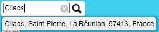
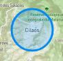
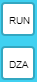
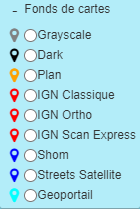
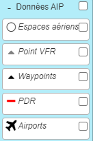
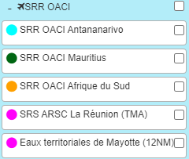
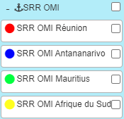
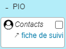
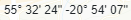

# Outil cartographique SAR

## Présentation

Afin de pouvoir dessiner une Zone Probable d’Accident et des zones de recherches, un outil cartographique en ligne est disponible pour la Réunion et Mayotte.

## Utilisation

### Menu latéral gauche

|||||
|--|--|--|--|
||zoomer dézoomer||Effectuer une recherche : code OACI ou nom de lieu  <i>Sélectionner le résultat pour visualiser sa localisation :</i> 
|  |Raccourcis vers La Réunion  Mayotte||Placer un marqueur Dessiner un segment Dessiner une zone rectangulaire Dessiner un polygone Dessiner un cercle Placer un marqueur circulaire Placer une zone de texte|
||Editer un élément||Découper un élément|
||Déplacer un élément||Supprimer un élément|
||Dessiner un radial / distance|<i>Appuyer une fois sur « Echap » pour dessiner un autre radial / distance distinct. Appuyer une 2nde fois sur « Echap » pour effacer les radials / distances.</i>|

### Menu Calques

✈ Cliquer sur « + » pour dérouler le sous-menu

|||||
|--|--|--|--|
||Sélection du fond de carte||Choix des données AIP|
||Afficher les secteurs SAR / Réunion||Afficher les communes / Mayotte|
||Afficher SRR / aéronautiques||Afficher SRR / maritimes|
||Afficher les contacts pour le PIO|

### Autres Fonctions

|||||
|--|--|--|--|
|Ajouter / Éditer / Supprimer un signet||Coordonnées du curseur <i>Entrer des coordonnées en dd pour y placer un marqueur</i>|

**Cliquer sur la date du jour** en haut au centre pour **exporter les éléments** (sauf les cercles) dans un fichier au format « gpx » → pour transmission aux partenaires (préfectures, CROSS SOI, ET50 …)

